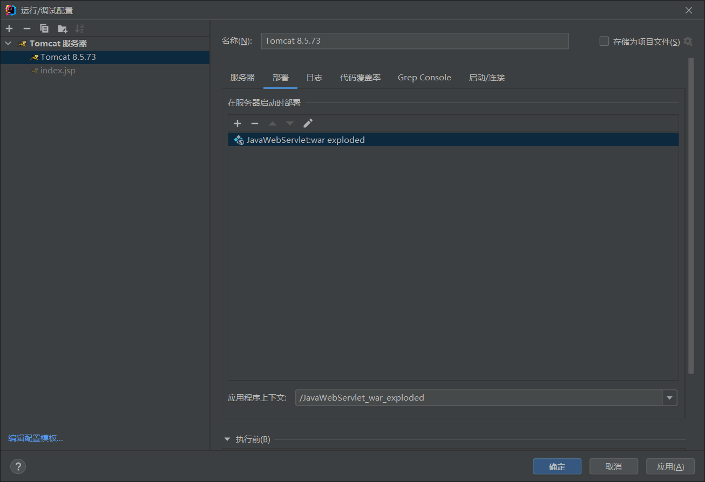
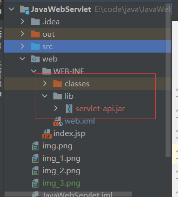

# servlet_simple_practice
hard hard and try again
## idea新建javaweb项目
+ 新建java项目
+ 添加web框架支持
+ 在web/WEB-INF下新建classes和lib文件夹
+ 设置模块编译输出路径

+ 设置lib目录为项目依赖


+ 配置tomcat 拷贝tomcat lib中的servlet-api.jar到项目lib中


## web.xml配置servlet

```
<servlet>
        <servlet-name>my</servlet-name>
        <servlet-class>com.demo.Myservlet</servlet-class>
        <load-on-startup>0</load-on-startup>
    </servlet>
    <servlet-mapping>
        <servlet-name>my</servlet-name>
        <url-pattern>/myservlet</url-pattern>
    </servlet-mapping>
```

servlet ：

servlet-name是别名，关键是servlet-class（带包名）要配置正确！

servlet-mapping：

url-pattern定义匹配规则，取值说明：
 + 精确匹配 /具体的名称 只有url路径是具体的名称的时候才会触发Servlet 
 + 后缀匹配 \*.XXX  只要是以xxx结尾的就匹配触发Servlet  
 + 通配符匹配 /* 匹配所有请求，包含服务器的所有资源 
 + 通配符匹配 / 匹配所有请求，包含服务器的所有资源，不包括.jsp
 
load-on-startup：
1. 元素标记容器是否应该在web应用程序启动的时候就加载这个servlet。
2. 它的值必须是一个整数，表示servlet被加载的先后顺序。
3. 如果该元素的值为负数或者没有设置时，则容器会当Servlet被请求时再加载。
4. 如果值为正整数或者0时，表示容器在应用启动时就加载并初始化这个servlet，值越小，servlet的优先级越高，就越先被加
载。值相同时，容器就会自己选择顺序来加载。

## 注解配置servlet
servlet3.0版本以后可以使用注解配置

+ name: Serlvet名字（可选）
+ value: 配置url路径,可以配置多个
+ urlPatterns：配置url路径，和value作用一样，不能同时使用
+ loadOnStartup:配置Servlet的创建的时机, 如果是0或者正数 启动程序时创建，如果是负数，则访问时创建。数字越小优先级越高

`@WebServlet(value = {"/ts","/test"})`等价于`@WebServlet(urlPatterns = {"/ts","/test"})`
